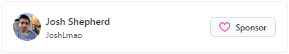

<!-- Workaround for align right with hyperlink-->

  <a href="https://genify.joshlmao.com" target="_blank">
    </img>
  </a>

  <h1>Genify</h1>

  
  
  
  

# About Genify

Combining the music from Spotify, the lyrics from Genius and the video from Youtube! Genify is a project aimed at combining all music resources together for the best experience.

Updated as of v3.0 to take use of React which will allow for easier updating!

## Lyric Libraries

Lyrics can be converted to their romanized version. Below is a list of all romanization currently supported and the appropriate API's used to make it happen

- Korean
    - [Aromanjize-JS by Fujaru](https://github.com/fujaru/aromanize-js)

- Chinese
    - [Pinyin4JS by SuperBiger](https://github.com/superbiger/pinyin4js)
    - [Traditional or Simplified by nickdrewe](https://github.com/nickdrewe/traditional-or-simplified)

- Japanese
    - [Kuroshiro by Hexenq](https://github.com/hexenq/kuroshiro)

- Russian:
    - [cyrillic-to-translit-js by greybax](https://www.npmjs.com/package/cyrillic-to-translit-js)

## Support me

If you enjoy this app, please consider supporting me through one of the options below. If not, thank you for using and enjoying the app! 🤗

    

    
    

